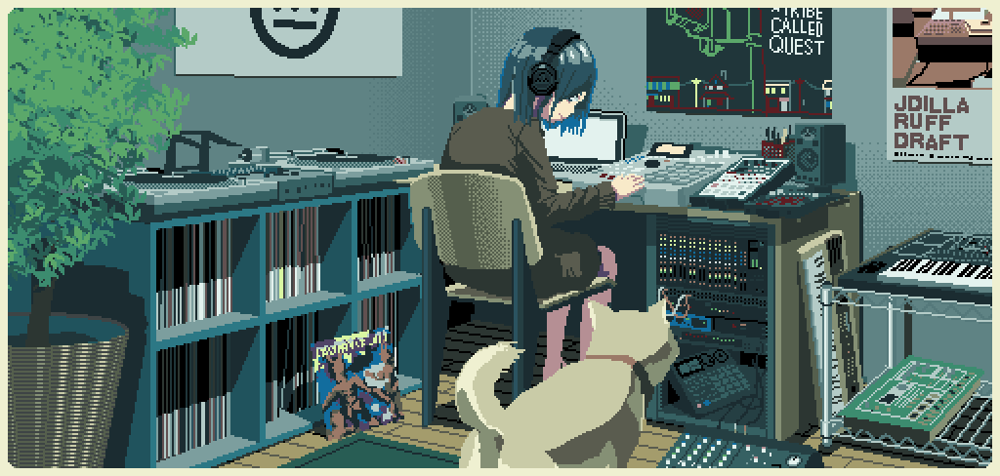

 

# Fatima Kamran

### Electrical Engineering Student

*"learning, building, and finding fascination in unexpected places."*

---

## About Me

I'm a second-year Electrical Engineering student who never imagined
ending up here — and somehow found myself becoming curious about
the very things I once knew little about.

Currently exploring the world of circuits, systems, code, and the
quiet beauty of how ideas become reality.

This GitHub is my little archive of things I build, break, learn,
and understand along the way.

---

## Currently Learning

⚡ Electrical Engineering concepts  
💻 Programming & computational thinking  
🧩 Problem solving through projects  
📚 Learning beyond the classroom  

---

## A Few Things About Me

📖 I enjoy reading and collecting ideas.  
🎧 I still prefer wired earphones over wireless ones.  
🌙 I like quiet spaces  
⚙️ Slowly discovering the world of engineering one project at a time.

---

## Projects

> A work in progress.

Projects, experiments, and ideas will find their way here soon.

---

## Connect

[LinkedIn](YOUR_LINK_HERE)

